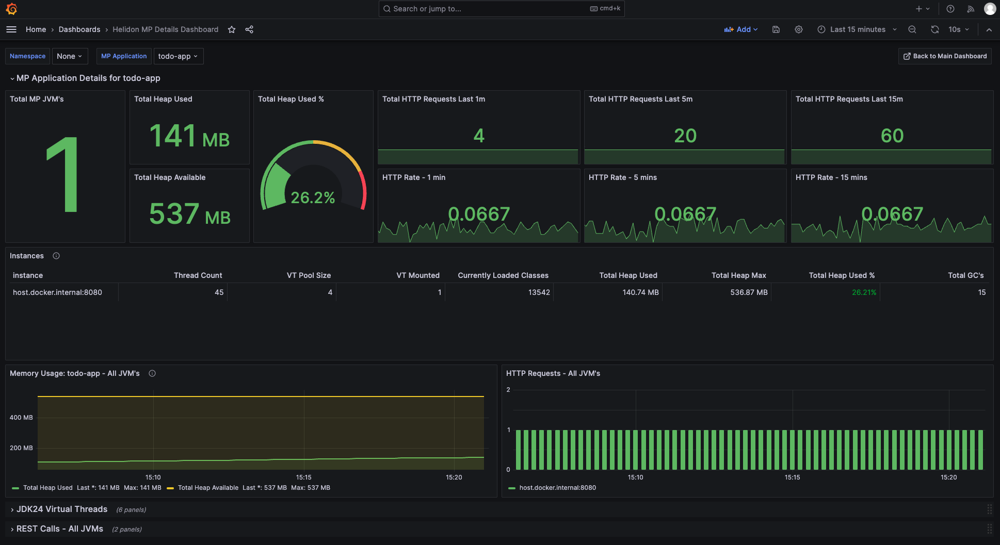

# Grafana Dashboards

This project contains updated Helidon grafana dashboards and the instructions on how to 
configure and enable additional metrics for Helidon SE and Helidon MP.

> Note: This document and its contents are work in progress only and not complete. 
> The information and dashboards may change or be removed.

## Table of Contents

* [Software Pre-requisites](#software-pre-requisites)
* [References](#references)
* [Helidon Setup](#helidon-setup)
  + [Application Identification](#application-identification)
  + [Required Dependencies](#required-dependencies)
  + [Enabling Metrics](#enabling-metrics)
* [Prometheus Setup](#prometheus-setup)
* [Grafana Setup](#grafana-setup)
* [grafana Dashboard Images](#grafana-dashboard-images)

## Software Pre-requisites

* JDK21 or JDK24
* Grafana 10.0.13+

## References

See the following for detailed information in Helidon metrics:

* [SE Metrics](https://helidon.io/docs/latest/se/guides/metrics#basic-and-extended-kpi)
* [Web Client Metrics](https://helidon.io/docs/latest/se/guides/webclient#WebClient-Metrics#WebClient-Metrics)
* [MP Metrics](https://helidon.io/docs/latest/mp/metrics/metrics)
* [MP REST Metrics](https://helidon.io/docs/latest/mp/guides/metrics#controlling-rest-request-metrics)
* [Helidon Labs Virtual Threads - JDK24](https://github.com/helidon-io/helidon-labs/tree/main/incubator/virtual-threads-metrics)

## Helidon Setup

### Application Identification

To ensure we can identify individual helidon applications as well as allowing drill-through, you should add the
following labels to your generated metrics using the system property or `META-INF/application.yaml` (SE) or `META-INF/microprofile-config.properties` (MP):

**Helidon SE**

* System Property: `-Dmetrics.app-name=my-se-app"`
* `META-INF/application.yaml`: 
  ```yaml
  metrics:
    app-name: "my-se-app"
  ```

This will add the label to the output for each metric, e.g.:

```bash
jvm_uptime_seconds{instance="host.docker.internal:7001", job="helidon", scope="base", app="my-se-app"}
```

**Helidon MP**

* System Property: `-Dmp.metrics.appName=my-mp-app`
* `microprofile-config.properties` `
   ```bash
   mp.metrics.appName=my-mp-app
   ```

This will add the label to the output for each metric, e.g.:

```bash
REST_request_seconds{... mp_app="my-mp-app", mp_scope="base", quantile="0.5"}
```

### Required Dependencies

**SE**

```xml
<dependency>
    <groupId>io.helidon.webclient</groupId>
    <artifactId>helidon-webclient-metrics</artifactId>
</dependency>

<dependency>
    <groupId>io.helidon.webserver.observe</groupId>
    <artifactId>helidon-webserver-observe-metrics</artifactId>
</dependency>

<dependency>
    <groupId>io.helidon.metrics</groupId>
    <artifactId>helidon-metrics-system-meters</artifactId>
    <scope>runtime</scope>
</dependency>
```

**MP**

Include the following:
```xml
<dependency>
    <groupId>io.helidon.microprofile.metrics</groupId>
    <artifactId>helidon-microprofile-metrics</artifactId>
</dependency>

<dependency>
    <groupId>io.helidon.webclient</groupId>
    <artifactId>helidon-webclient-metrics</artifactId>
    <scope>runtime</scope>
</dependency>

<dependency>
    <groupId>io.helidon.metrics</groupId>
    <artifactId>helidon-metrics-system-meters</artifactId>
    <scope>runtime</scope>
</dependency>
```

To include additional, experimental virtual threads metrics, available only in JDK 24, you can clone Helidon Labs at
https://github.com/helidon-io/helidon-labs.git and build and include the following:

```xml
<dependency>
    <groupId>io.helidon.labs.incubator</groupId>
    <artifactId>helidon-labs-incubator-virtual-threads-metrics</artifactId>
    <version>1.0.0-SNAPSHOT</version>
    <scope>runtime</scope>
</dependency>
```

### Enabling Metrics

Additional properties are required to ensure we get the full range of metrics:

> Note: These are shown as config file settings but can be set in any relevant SE or MP config source.

**Helidon SE**

*application.yaml*
```yaml
metrics:
  app-name: "my-se-app"
  key-performance-indicators:
    extended: true
  virtual-threads:
    enabled: true
  gc-time-type: GAUGE
```

**Helidon MP**

*META-INF/microprofile-config.properties*

```properties
mp.metrics.appName=my-mp-app
metrics.key-performance-indicators.extended=true
metrics.virtual-threads.enabled=true
metrics.gc-time-type=GAUGE
metrics.rest-request.enabled=true
```

See [here](https://helidon.io/docs/latest/mp/guides/metrics#controlling-rest-request-metrics) for more details on REST specific metrics for MP.

## Prometheus Setup

* SE Apps http://host:port/observe/metrics
* MP Apps http://host:port/metrics

## Grafana Setup

TBC

## Troubleshooting

TBC

## Grafana Dashboard Images

The section below outlines the initial "work-in-progress" Grafana dashboards.

### Main DashBoard


### SE Details Dashboard


### SE Details Dashboard (Virtual Threads)


### MP Details Dashboard



### MP Details Dashboard (Threads and REST)


