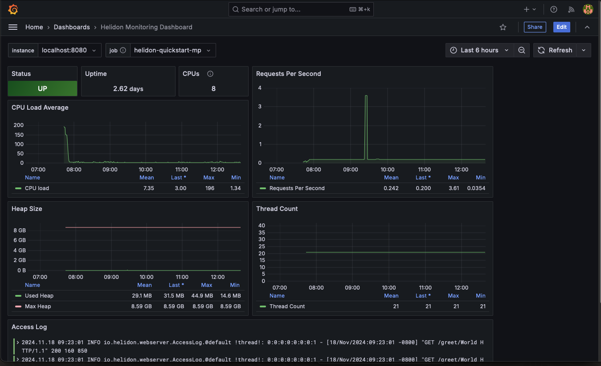

# Grafana Dashboard for Helidon

In this lab you will:

1. Create, build and run a Helidon MP application (service)
2. Install, configure and run [Grafana](https://grafana.com/docs/grafana/latest/), [Prometheus](https://prometheus.io/docs/introduction/overview/), [Loki](https://grafana.com/docs/loki/latest/) and [Promtail](https://grafana.com/docs/loki/latest/send-data/promtail/)
3. Import a Helidon Dashboard into Grafana
4. View metrics and log data from the Helidon application

If all you want is to grab the Grafana dashboard for Helidon then get it here: [helidon_dashboard.json](helidon-dashboard.json)

## Pre-requisites

1. Java 21 and Maven
2. The `helidon` CLI ([installation](https://helidon.io/docs/v4/about/cli))
3. Grafana ([installation](https://grafana.com/docs/grafana/latest/setup-grafana/installation/))
4. Prometheus ([installation](https://prometheus.io/docs/prometheus/latest/installation/))
5. Loki ([installation](https://grafana.com/docs/loki/latest/setup/install/)
6. Promtail ([installation](https://grafana.com/docs/loki/latest/send-data/promtail/installation/)

On MacOS you should be able to install the above using `brew`.

This lab does not use or assume Docker. All processes will be run natively on your system.

## Overview

In this lab we will use the PLG stack: Prometheus, Loki and Grafana. Plus Promtail for log file scraping.

Grafana is used to visualize data from data sources. Prometheus and Loki will be used in this lab as data sources:

1. Prometheus: a repository for time series (metric) data
2. Loki: a repository for log records

To get metrics into Prometheus we configure Prometheus to scrape metrics from the `/metrics` endpoint of the Helidon MP application.

To get log records into Loki we use Promtail to scrape log files from the local disk and push them to the Loki repository.

## Create, build and run the Helidon Application

Using the Helidon CLI create a basic Helidon MP application:

```shell
helidon init --version 4.1.4 --flavor MP --archetype quickstart --batch
```

Next build and run the application:

```shell
cd quickstart-mp
mvn clean install
java -jar target/quickstart-mp.jar
```

Congratulations! You have a Helidon service up and running. It will be listening on port 8080. Try it in another terminal:

```shell
curl -X GET http://localhost:8080/greet/
curl -X GET http://localhost:8080/greet/Joe
curl -X GET http://localhost:8080/metrics
```

The last curl command gets metrics from the built-in metrics endpoint in the Helidon application.

Now quit the Helidon application (^C).

## Modify Helidon Application

In addition to metrics we want our Helidon service to generate an access log file.

Add this dependency to the `quickstart-mp/pom.xml`:

```xml
<dependency>
    <groupId>io.helidon.microprofile</groupId>
    <artifactId>helidon-microprofile-access-log</artifactId>
</dependency>
```

This enables access logging by the Helidon application. Next configure Java Util Logging to write
these logs to disk instead of the console;

Edit `./src/main/resources/logging.properties` and add the following:

```properties
# Use the FileHandler for the HTTP Access logs and don't send messages to parent logger (console)
io.helidon.webserver.AccessLog.handlers=java.util.logging.FileHandler
io.helidon.webserver.AccessLog.useParentHandlers=false
# Configure FileHandler to use files in home directory.
# Rotate logs across 4 files. access-0.log is always the newest
# Limit file size to roughly 1MB, this is small to demonstrate rolling behavior
java.util.logging.FileHandler.pattern = %h/logs/helidon-quickstart-mp/access-%g.log
java.util.logging.FileHandler.count = 4
java.util.logging.FileHandler.limit = 1047552
java.util.logging.FileHandler.formatter = java.util.logging.SimpleFormatter
java.util.logging.FileHandler.level = INFO
```

Create the directory to hold the access log files:

```shell
mkdir -p ~/logs/helidon-quickstart-mp/
```

Build and run the Helidon application:

```shell
mvn clean install
java -jar target/quickstart-mp.jar
```

In another terminal try it:

```shell
curl -X GET http://localhost:8080/greet/
```

You should see access log files in the directory we configured above:

```shell
ls ~/logs/helidon-quickstart-mp/
cat ~/logs/helidon-quickstart-mp/access-0.log
```

## Configure and Start Promtail, Loki, Prometheus, and Grafana

Next is to install and configure the monitoring stack. For convenience we put configuration for our
monitoring stack in a common directory. You can find these configuration files in the same directory as this README.

```shell
mkdir -p ~/.config
cp loki-local-config.yaml promtail-local-config.yaml prometheus.yaml ~/.config/
```

Take a look at these configuration files. We won't go into detail here, but you should be able to see how they
configure Prometheus to scrape metrics from our Helidon application. And how Promtail is configured to scrape
the access log files from `~/logs/helidon-quickstart-mp/` and send them to Loki.

Next, start the monitoring stack. Create four terminal windows and start each of
these in the foreground so you can easily see what they are doing.

These commands are based on the default install locations of `brew` on MacOS. You should adjust these commands
to match your environment.

```shell
/usr/local/bin/promtail --config.file=${HOME}/.config/promtail-local-config.yaml
/usr/local/bin/loki --config.file=${HOME}/.config/loki-local-config.yaml
/usr/local/bin/prometheus --config.file=${HOME}/.config/prometheus.yaml

/usr/local/bin/grafana server \
    --config /usr/local/etc/grafana/grafana.ini \
    --homepath /usr/local/opt/grafana/share/grafana \
    --packaging\=brew \
    cfg:default.paths.logs\=/usr/local/var/log/grafana \
    cfg:default.paths.data\=/usr/local/var/lib/grafana \
    cfg:default.paths.plugins\=/usr/local/var/lib/grafana/plugins
```

## Log into Grafana and define data sources

Now that the PLG infrastructure is up and running, log into Grafana and define the data sources for Prometheus and Loki.

In a web browser connect to Grafana:

```text
http://localhost:3000
```

When prompted use the username/password as documented in the Grafana installtion (possibly admin/admin).
Once logged into Grafana:

1. Click the hamburger menu icon on the left to get the menu.
2. Click on Add new connection
3. Search for Prometheus and click on the "Prometheus" data source, then "Add new data source". Ensure that the Connection URL is correct for your instance of Prometheus.
4. Repeat the above for Loki.

## Import Helidon dashboard

Now that the data sources are defined, import the Helidon dashboard.

1. Click on Dashboards
2. Click on New->Import
3. Import the dashboard by either dragging and dropping [helidon-dashboard.json](./helidon-dashboard.json) or Load the contents using copy past.

## View the Helidon dashboard

Now you can view the dashboard:

1. Click on Dashboards
2. Click on Helidon Monitoring Dashboard

It should look something like this:



Details about how Grafana and the PLG stack work is outside of the scope of this lab. But to hilight a couple things:

1. When metrics are produced by the Helidon application, and when they are ingested by Prometheus, they are tagged with labels that can be used to filter the data.
2. When you create a visualization panel in Grafana you define an expression used to select and filter the metric you want to display.
3. At the top of the Helidon dashboard are two variables: "job" and "instance". These variables are used by the expressions in the panel configurations to select metrics for the instance of the Helidon MP application you are running.

## Generate load on the Helidon application

To generate a load on the Helidon application you can run this command to send bursts of 500 requests.

```shell
curl -s  \
  --noproxy '*' \
  -o /dev/null \
  --parallel \
  --parallel-immediate \
  -w "%{http_code}\n" \
  "http://localhost:8080/greet/World?c=[1-500]"
```
