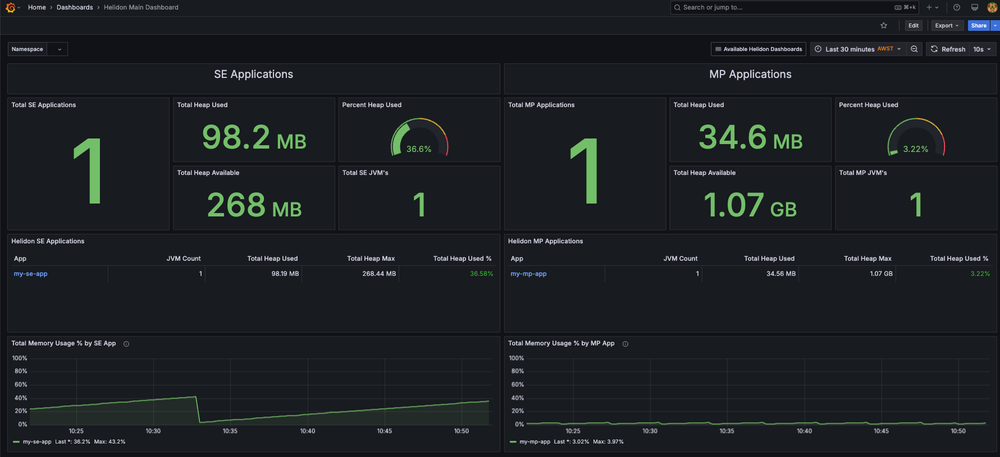
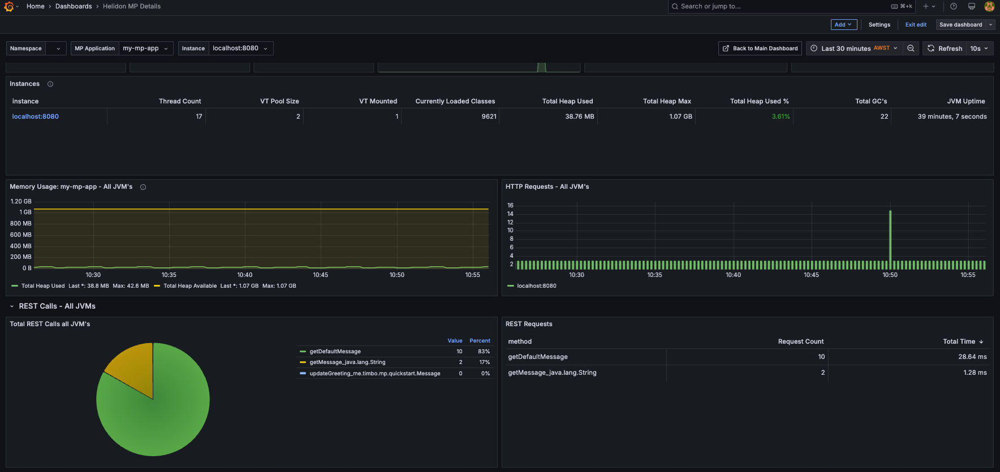
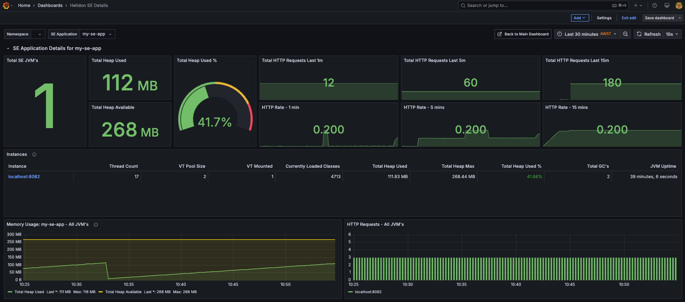
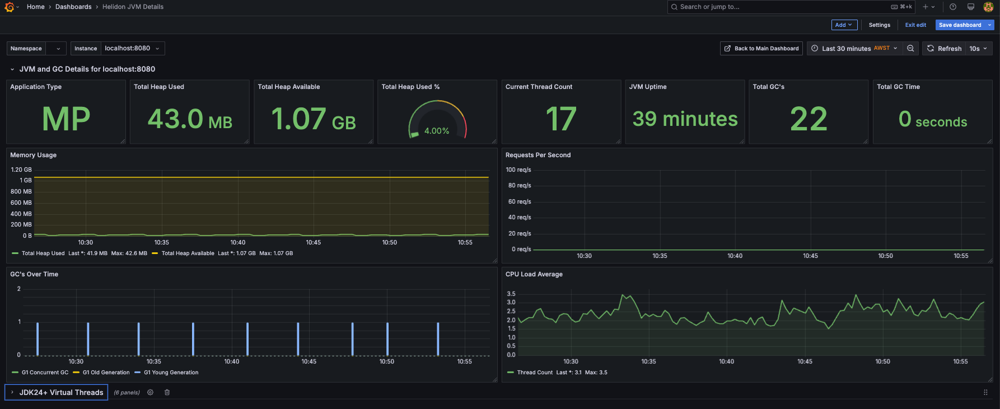
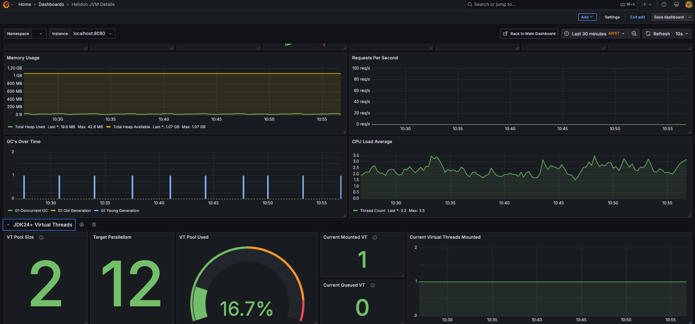
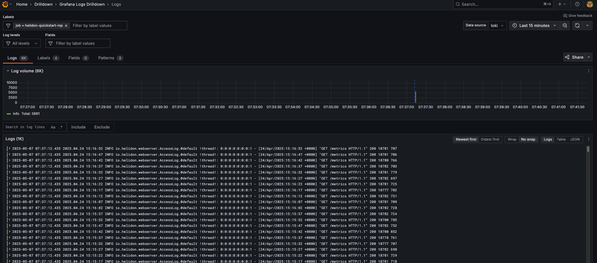

# Grafana Dashboards for Helidon

In this lab you will:

1. Create, build and run Helidon MP and SE applications
2. Install, configure and run [Grafana](https://grafana.com/docs/grafana/latest/), [Prometheus](https://prometheus.io/docs/introduction/overview/), [Loki](https://grafana.com/docs/loki/latest/) and [Promtail](https://grafana.com/docs/loki/latest/send-data/promtail/)
3. Import Helidon Dashboards into Grafana
4. View metrics and log data from the Helidon application

> Note: If all you want is to grab the Grafana dashboards for Helidon then they are available [here](dashboards).

## Pre-requisites

1. Java 21 and Maven
2. The `helidon` CLI ([installation](https://helidon.io/docs/v4/about/cli))
3. Grafana ([installation](https://grafana.com/docs/grafana/latest/setup-grafana/installation/))
4. Prometheus ([installation](https://prometheus.io/docs/prometheus/latest/installation/))
5. Loki ([installation](https://grafana.com/docs/loki/latest/setup/install/)
6. Promtail ([installation](https://grafana.com/docs/loki/latest/send-data/promtail/installation/)
7. Clone this GitHub repository - https://github.com/helidon-io/helidon-labs

> Note: Optionally you can use JDK24 to show experimental virtual threads metrics.

On MacOS you should be able to install the above using `brew`.

This lab was tested with:
* Grafana 11.6.0
* Prometheus 3.3.0
* Loki 3.4.3
* Promtail 3.4.3

This lab does not use nor assume Docker. All processes will be run natively on your system.

## Table of Contents

* [Overview](#overview)
* [Create the applications](#create-the-applications)
    + [Create, build and run the Helidon MP application](#create-build-and-run-the-helidon-mp-application)
    + [Create, build and run the Helidon SE application](#create-build-and-run-the-helidon-se-application)
* [Enable virtual threads metrics (optional)](#enable-virtual-threads-metrics-optional)
* [Add application identification to metrics](#add-application-identification-to-metrics)
* [Enable logging in Helidon MP](#enable-logging-in-helidon-mp)
* [Configure and start Promtail, Loki, Prometheus, and Grafana](#configure-and-start-promtail-loki-prometheus-and-grafana)
* [Configure Grafana](#configure-grafana)
    + [Log into Grafana and define data sources](#log-into-grafana-and-define-data-sources)
    + [Import the Helidon dashboards](#import-the-helidon-dashboards)
    + [View the Helidon Dashboards](#view-the-helidon-dashboards)
    + [All dashboards Preview](#all-dashboards-preview)
* [Generate load on the Helidon applications](#generate-load-on-the-helidon-applications)
* [Start additional MP and SE JVM's](#start-additional-mp-and-se-jvms)
* [Explore the Loki logs](#explore-the-loki-logs)

## Overview

In this lab we will use the PLG stack: Prometheus, Loki and Grafana. Plus Promtail for log file scraping.

Grafana is used to visualize data from data sources. Prometheus and Loki will be used in this lab as data sources:

1. Prometheus: a repository for time series (metric) data
2. Loki: a repository for log records

We will create quickstart MP and SE applications and configure Prometheus to scrape metrics from the `/metrics` endpoint of the
Helidon MP application and the `/metrics/observe` endpoint of the Helidon SE application.

This lab will walk you through setting up metrics for each of the applications, but for more details on metrics setup
refer to the detailed [metrics setup document](metrics_setup.md).

To get log records into Loki we use Promtail to scrape log files from the local disk and push them to the Loki repository.

## Create the applications

### Create, build and run the Helidon MP Application

Using the Helidon CLI create a basic Helidon MP application:

```shell
helidon init --version 4.2.1 --flavor MP --archetype quickstart --batch
```

Next build and run the application:

```shell
cd quickstart-mp
mvn clean install
java -Xmx1g -Xmx1g -jar target/quickstart-mp.jar
```

Congratulations! You have a Helidon service up and running. It will be listening on port 8080. Try it in another terminal:

```shell
curl -X GET http://localhost:8080/greet/
curl -X GET http://localhost:8080/greet/Joe
curl -X GET http://localhost:8080/metrics
```

The last curl command gets metrics from the built-in metrics endpoint in the Helidon application.

Now quit the Helidon application (^C).

### Create, build and run the Helidon SE application

Using the Helidon CLI create a basic Helidon SE application:

```shell
helidon init --version 4.2.1 --flavor SE --archetype quickstart --batch
```

Next build and run the SE application:

```shell
cd quickstart-se
mvn clean install
java -Xmx256m -Xmx256m -Dserver.port=8082 -jar target/quickstart-se.jar
```

Congratulations! You have a Helidon SE service up and running. It will be listening on port 8082. Try it in another terminal:

```shell
curl -X GET http://localhost:8082/simple-greet
curl -X GET http://localhost:8082/greet/Tim
curl -X GET http://localhost:8082/observe/metrics
```

The last curl command gets metrics from the built-in metrics endpoint in the Helidon SE application.

Now quit the Helidon application (^C).

## Enable virtual threads metrics (Optional)

If you are running with JDK24, you can include additional experimental virtual threads metrics. Change directory to the cloned `helidon-labs` repository,
and build using JDK24 include the following in each of the generated MP and SE `pom.xml`.

```xml
<dependency>
    <groupId>io.helidon.labs.incubator</groupId>
    <artifactId>helidon-labs-incubator-virtual-threads-metrics</artifactId>
    <version>1.0.0-SNAPSHOT</version>
    <scope>runtime</scope>
</dependency>
```

## Add application identification to metrics

To ensure we can identify individual helidon applications as well as allowing drill-through, we need to add the
following labels to your generated metrics using the system property or `META-INF/application.yaml` (SE) or `META-INF/microprofile-config.properties` (MP)

### Helidon MP

Add the following to your `META-INF/microprofile-config.properties` in the `quickstart-mp` application to identify the application and enable additional metrics.

> Note: The `mp.metrics.appName` setting will add a label to all prometheus metrics with `mp_app="my-mp-app"` which is used by the dashboards to display MP specific information.

*META-INF/microprofile-config.properties*
```properties
mp.metrics.appName=my-mp-app
metrics.key-performance-indicators.extended=true
metrics.gc-time-type=GAUGE
metrics.virtual-threads.enabled=true
```

Change the existing value of `metrics.rest-request.enabled` to `true`.

### Helidon SE

Add the following to your `META-INF/application.yaml` in the `quickstart-se` application to identify the application and enable additional metrics.

*application.yaml*
```yaml
metrics:
  app-name: "my-se-app"
  key-performance-indicators:
    extended: true
  virtual-threads:
    enabled: true
  gc-time-type: GAUGE
```

> Note: The `app-name` setting will add a label to all prometheus metrics with `app="my-se-app"` which is used by the dashboards to display Helidon SE specific information.

## Enable logging in Helidon MP

In addition to metrics we want our Helidon service to generate an access log file.

Add this dependency to the `quickstart-mp/pom.xml`:

```xml
<dependency>
    <groupId>io.helidon.microprofile</groupId>
    <artifactId>helidon-microprofile-access-log</artifactId>
</dependency>
```

This enables access logging by the Helidon application. Next configure Java Util Logging to write
these logs to disk instead of the console;

Edit `./src/main/resources/logging.properties` and add the following:

```properties
# Use the FileHandler for the HTTP Access logs and don't send messages to parent logger (console)
io.helidon.webserver.AccessLog.handlers=java.util.logging.FileHandler
io.helidon.webserver.AccessLog.useParentHandlers=false
# Configure FileHandler to use files in home directory.
# Rotate logs across 4 files. access-0.log is always the newest
# Limit file size to roughly 1MB, this is small to demonstrate rolling behavior
java.util.logging.FileHandler.pattern = %h/logs/helidon-quickstart-mp/access-%g.log
java.util.logging.FileHandler.count = 4
java.util.logging.FileHandler.limit = 1047552
java.util.logging.FileHandler.formatter = java.util.logging.SimpleFormatter
java.util.logging.FileHandler.level = INFO
```

Create the directory to hold the access log files:

```shell
mkdir -p ~/logs/helidon-quickstart-mp/
```

Re-build and run the Helidon application:

```shell
mvn clean install
java -Xmx1g -Xmx1g -jar target/quickstart-mp.jar
```

In another terminal try it:

```shell
curl -X GET http://localhost:8080/greet/
```

You should see access log files in the directory we configured above:

```shell
ls ~/logs/helidon-quickstart-mp/
cat ~/logs/helidon-quickstart-mp/access-0.log
```

## Start both Helidon applications

1. Start the Helidon MP application, as described in the previous step if it is not already started
2. Rebuild and start the Helidon SE application using the following:
   ```bash
    java -Xmx256m -Xmx256m -Dserver.port=8082 -jar target/quickstart-se.jar
    ```

## Configure and start Promtail, Loki, Prometheus, and Grafana

Next is to install and configure the monitoring stack. For convenience, we put the configuration files for the
monitoring stack in a common directory. You can find these configuration files in the same directory as this README.

```shell
mkdir -p ~/.config
cp loki-local-config.yaml promtail-local-config.yaml prometheus.yaml ~/.config/
```

Take a look at these configuration files. We won't go into detail here, but you should be able to see how they
configure Prometheus to scrape metrics from our Helidon application. And how Promtail is configured to scrape
the access log files from `${HOME}/logs/helidon-quickstart-mp/` and send them to Loki.

Next, start the monitoring stack. Create four terminal windows and start each of
these in the foreground so you can easily see what they are doing.

These commands are based on the default install locations of `brew` on MacOS. You should adjust these commands
to match your environment.

```shell
promtail -config.expand-env=true --config.file=${HOME}/.config/promtail-local-config.yaml
```

```shell
loki --config.file=${HOME}/.config/loki-local-config.yaml
```

```shell
prometheus --config.file=${HOME}/.config/prometheus.yaml
```

```shell
grafana server \
    --config /opt/homebrew/etc/grafana/grafana.ini \
    --homepath /opt/homebrew/opt/grafana/share/grafana \
    --packaging\=brew \
    cfg:default.paths.logs\=/opt/homebrew/var/log/grafana \
    cfg:default.paths.data\=/opt/homebrew/var/lib/grafana \
    cfg:default.paths.plugins\=/opt/homebrew/var/lib/grafana/plugins
```

## Configure Grafana

### Log into Grafana and define data sources

Now that the PLG infrastructure is up and running, log into Grafana and define the data sources for Prometheus and Loki.

In a web browser connect to Grafana: http://localhost:3000

When prompted use the username/password as documented in the Grafana installation (possibly admin/admin).
Once logged into Grafana:

1. Click the Grafana menu icon on the left to get the menu.
2. Click on Add new data source
3. Search for Prometheus and click on the `Prometheus` data source, then `Add new data source`. Ensure that the Connection URL is correct for your instance of Prometheus.
4. Repeat the above for Loki.

The ports used by Loki and Prometheus should be the default ports.

### Import the Helidon dashboards

There are four dashboards as part of this lab.

* `helidon-main-dashboard.json` - Helidon Main Dashboard showing MP and SE applications summary
* `helidon-mp-details.json` - Helidon MP Details Dashboard showing details about a selected Helidon MP application
* `helidon-se-details.json` - Helidon SE Details Dashboard showing details about a selected Helidon SE application
* `helidon-jvm-details.json` - Helidon JVM Detail Dashboard show JMV specific details including memory, GC and virtual threads

> Note: Each dashboard has a defined default Prometheus datasource called `prometheus`.

For each dashboard file:

1. Click on Dashboards
2. Click on New->Import
3. Import the dashboard by either dragging and dropping the dashboard file or Load the contents using copy and paste.

### View the Helidon dashboards

Now you can view the main dashboard via:

1. Click on Dashboards
2. Click on `Helidon Main Dashboard`

Or access via http://localhost:3000/d/helidon-main-dashboard.

It should look something like this:



Details about how Grafana and the PLG stack work is outside the scope of this lab. But to highlight a couple of things:

1. When metrics are produced by the Helidon applications, and when they are ingested by Prometheus, they are tagged with labels that can be used to filter the data. 
2. When you create a visualization panel in Grafana you define an expression used to select and filter the metric you want to display.
3. At the top of the dashboard you can see the Namespace. This will be selectable if you are running within Kubernetes
4. You can select the `my-se-app` or `my-mp-app` links which will take you through to the SE or MP details dashboards
5. Once in these dashboards, you can click on an instance such as `localhost:8080` which will take you through to the Helidon JVM Details Dashboard

### All Dashboards Preview

**Helidon Main Dashboard**

This dashboard shows a summary of all running SE and MP applications and allows drill down to specific
applications for more insight.


**Helidon MP Details**

This dashboard shows specific information about the selected MP application as well as details of REST calls as shown in the next image.
You can drill down to individual instances for more JVM details.




**Helidon SE Details**

This dashboard shows specific information about the selected SE application. You can drill down to individual instances for more JVM details.



**Helidon JVM Details**

This dashboard shows individual JVM details including memory, thread counts, JVM uptime, detailed GC details and 
JDK24+ virtual threads information if enabled, as show in the second image.





## Generate load on the Helidon applications

### Helidon MP

To generate a load on the Helidon MP application you can run this command to send bursts of 500 requests.

Once you run this a few times, navigate to the MP application page and notice the REST count and generate request counts increase.

```shell
curl -s  \
  --noproxy '*' \
  -o /dev/null \
  --parallel \
  --parallel-immediate \
  -w "%{http_code}\n" \
  "http://localhost:8080/greet/World?c=[1-500]"
```

### Helidon SE

Run the same curl command above but change the port to `8082`.

## Start additional MP and SE JVM's

Start an additional MP application JVM on port `8081` by running the following, and run curl requests against it.

```bash
java -Xmx1g -Xmx1g -Dserver.port=8081 -jar target/quickstart-mp.jar
```

You should see the total MP JVM count updated to 2, and when you navigate to the MP Details dashboards you 
should see the additional JVM.

Start and addition SE application on JVM port `8083`, by running the following, and explore the dashboards.

```bash
java -Xmx256m -Xmx256m -Dserver.port=8083 -jar target/quickstart-se.jar
```

> Note: The additional JVM's are picked up by prometheus as the [prometheus.yaml](prometheus.yaml) configuration
> already contains the ports to scrape from.

## Explore the Loki logs

If you wish to explore the Loki logs you can do the following in Grafana:

1. Open the Grafana menu at the top left, and click on `Explore`
2. Select the `Loki` datasource
3. Enter the following in the query and click `Run Query`
   `{job="helidon-quickstart-mp"}`
4. You should see something similar to the following showing the collected logs:
    

