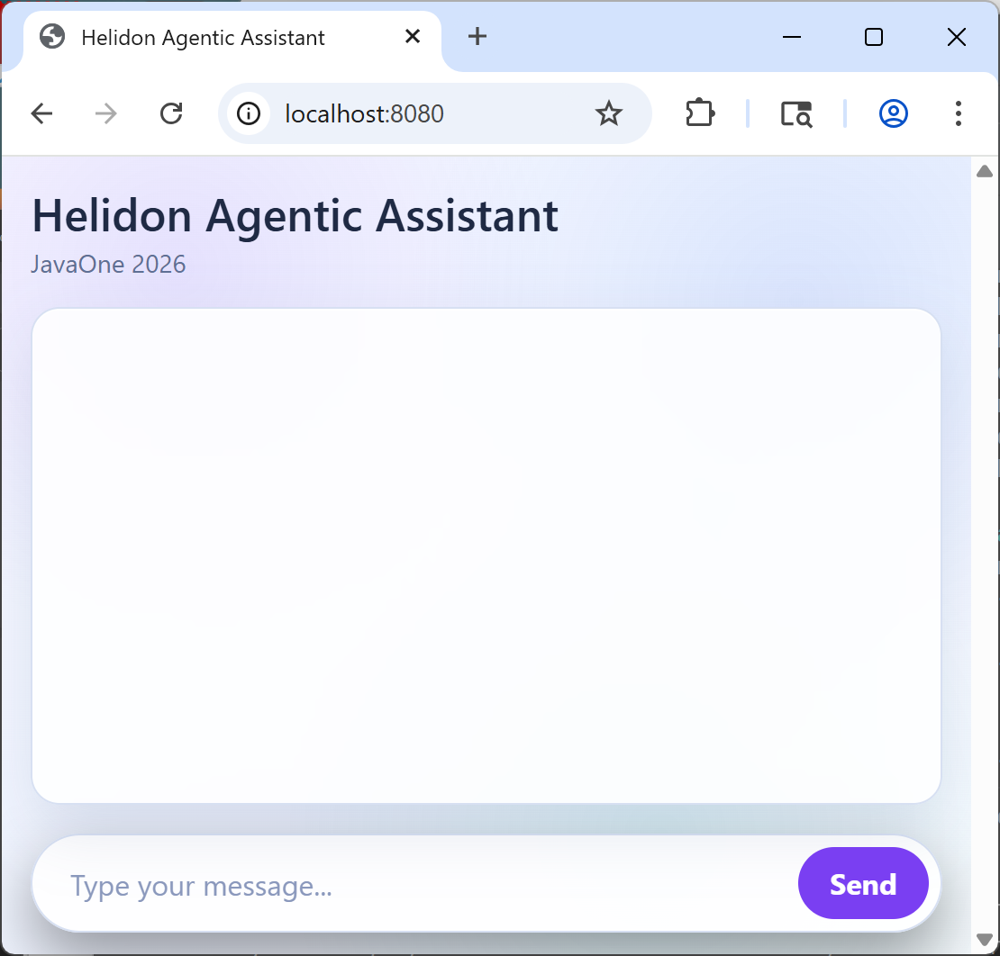

# 2. Setting Up the Bootstrap Project

In this section, we will:

- Build and run the bootstrap project from `code/bootstrap`.
- Verify REST endpoints and UI.
- Establish the starting point before we transform it into the final agentic app.

---

## 1. Open the bootstrap project

```sh
cd langchain4j-agentic/code/bootstrap
```

## 2. Build the project

```sh
mvnw clean package
```

## 3. Run the bootstrap application

```sh
java -jar target/helidon-basic-assistant.jar
```

## 4. Verify web UI

Open the chat UI at http://localhost:8080

You should see Helidon Assistant prompt UI.




Example prompt:
```
Show me how to create a new Helidon SE application named javaone-demo with cli showing a HTTP resource with Hello World.
```

> [!NOTE]
> Notice that Helidon assistant has no specialization, AI service uses a single big embedding store 
for all the prompts regardless of the Helidon flavor (SE or MP) the user is asking for. 
Response mixes all the context it gets from the emebeding store together.

Stop the app after verification. (return to your terminal and type [CMD/CONTROL-C])


---

### Next Step → [Configuring the Project for Agentic AI](03_configuring_the_project_for_agentic_ai.md)

