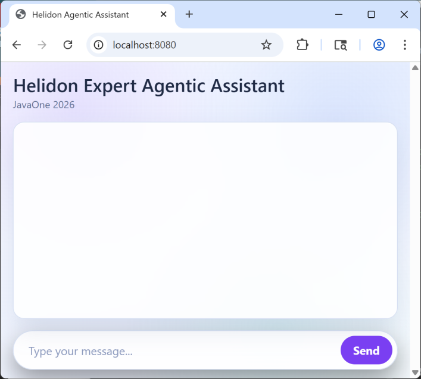

# 7. Building and Running the Final Assistant

In this section, we will:

- Build and run your updated `code/bootstrap` project.
- Validate agent routing and tool usage behavior.
- Verify your project matches the final implementation.

---

## 1. Build and run

From `hols/langchain4j-agentic/code/bootstrap`:

```sh
./mvnw clean package
```

```sh
java -jar target/*.jar
```

## 2. Verify web UI

Open the chat UI at http://localhost:8080

You should see Helidon Expert Assistant prompt UI.



This expert uses the previously created embeddings stores that were saved to JSON files on your local disk. There is one each for the SE and MP Experts.

Example prompt:
```
Show me how to create a new Helidon SE application named javaone-demo with cli showing a HTTP resource with Hello World with latest Helidon version.
```

> [!NOTE]
> Notice that the Helidon assistant now decides which Helidon flavor (SE/MP) the question is about and selects the
> appropriate specialized agent to answer it. 
> Each specialized agent uses a separate embedding store with documents related to a single Helidon flavor, making
> the response tailored to the correct product.

You can check the system output to see how the agentic workflow proceeded and whether any tools were executed:
```
INFO: Activate SE Expert!
INFO: Latest released Helidon version: 4.4.0-FROM-TOOL
INFO: Init with Helidon cli cmd called, version: 4.4.0-FROM-TOOL, project name: javaone-demo
```
> [!NOTE]
> Notice how version `4.4.0-FROM-TOOL` was provided by the CliTool from the YAML configuration file.

---

### Next Step -> [Bonus: Using MCP Server Instead of Local Tools](08_bonus_using_mcp_server.md)

