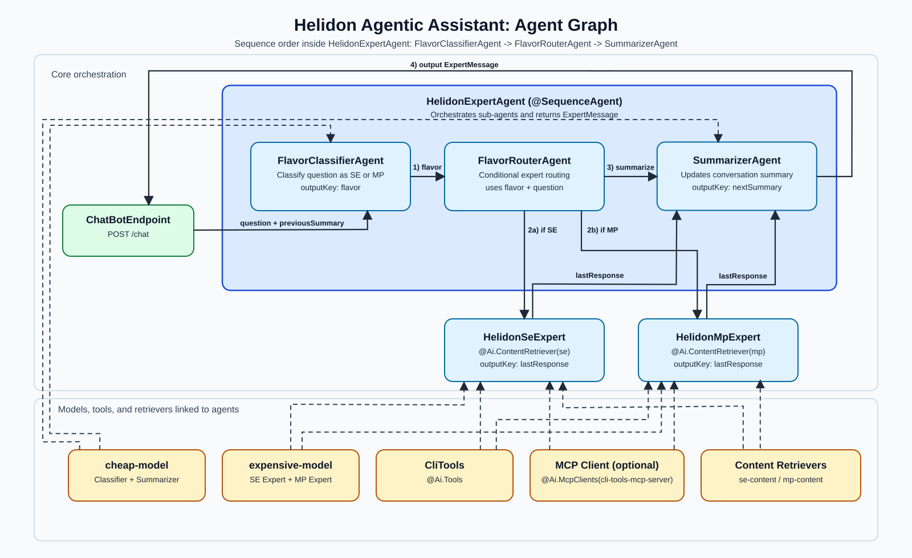

# HOL: Building Agentic AI Applications with Helidon and LangChain4J

In this hands-on lab, you will build an **agentic AI assistant** with **Helidon** and **LangChain4J**.  
Starting from the bootstrap project, you will evolve it into a multi-agent system that classifies user intent, routes requests to specialized experts, applies RAG, and returns summarized conversational context.

## What You'll Learn

- How to build an **agentic workflow** with `@SequenceAgent` and `@ConditionalAgent`.
- How to split responsibilities across agents: classifier, router, expert agents, and summarizer.
- How to configure and use multiple models (cheap vs expensive) for different agent tasks.
- How to use separate **embedding stores** and **content retrievers** for Helidon SE and MP knowledge.
- How to add tool usage with local `@Ai.Tools` and switch to MCP using `@Ai.McpClients`.
- How to transform `code/bootstrap` into the final implementation in `hols/langchain4j-agentic/code/final`.

## Agentic Architecture (Final Project)

Final code location: `hols/langchain4j-agentic/code/final`

### Helidon Agentic Assistant Overview

The final application uses an **agentic design** built with **LangChain4j Agentic APIs** and integrated into a **Helidon declarative** application model.
Instead of a single chat call, the assistant coordinates multiple agents with distinct responsibilities:

- **`FlavorClassifierAgent`** classifies the request as Helidon **SE** or **MP**.
- **`FlavorRouterAgent`** conditionally routes the request to the right expert agent.
- **`HelidonSeExpert`** and **`HelidonMpExpert`** answer using flavor-specific RAG context.
- **`SummarizerAgent`** maintains concise conversation continuity across requests.

This orchestration is executed by **`HelidonExpertAgent`** as a sequence, giving a predictable, composable multi-agent flow while still running as a standard Helidon service endpoint.

### Local Embeddings and RAG in This HOL

The HOL uses a **local embedding model** (`all-minilm-l6-v2-q`, in-process) and **local in-memory embedding stores** (separate stores for SE and MP).
At application startup, Helidon documentation is unpacked, chunked, embedded, and stored for retrieval.

Because this ingestion runs at startup, it can take a bit of time before RAG context is fully available.
Early prompts may be answered with less Helidon-specific context; responses become more grounded as ingestion progresses.

### Tracking Ingestion Progress in the UI

Open the UI at:

`http://localhost:8080`

The UI shows ingestion progress, so you can see when embedding is still running and when it is complete.
Once progress reaches completion (remaining work reaches zero), prompts should consistently include richer Helidon context from RAG.

## Table of Contents

1. [Setting Up the Environment](./01_setting_up_the_environment.md)
2. [Setting Up the Bootstrap Project](./02_setting_up_the_bootstrap_project.md)
3. [Configuring the Project for Agentic AI](./03_configuring_the_project_for_agentic_ai.md)
4. [Creating the Orchestrator Agent](./04_creating_the_orchestrator_agent.md)
5. [Adding Specialized Experts and Tools](./05_adding_specialized_experts_and_tools.md)
6. [Wiring RAG and REST Endpoint](./06_wiring_rag_and_rest_endpoint.md)
7. [Building and Running the Final Assistant](./07_building_and_running_the_final_assistant.md)
8. [Bonus: Using MCP Server Instead of Local Tools](./08_bonus_using_mcp_server.md)

Let's get started.

### [Start the Hands-on Lab ->](./01_setting_up_the_environment.md)
